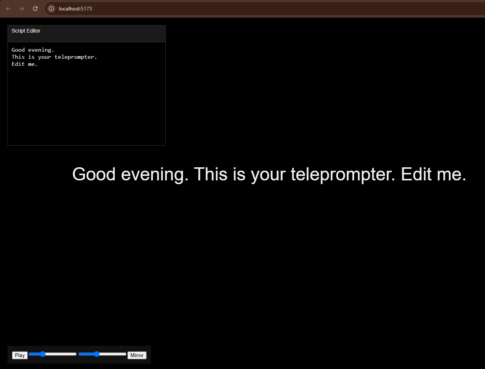

# React Teleprompter

A lightweight teleprompter application built with **React + Vite**.  
Designed for smooth scrolling, live script editing, and real teleprompter workflows.

---

## Features

- Smooth auto-scrolling text
- Play / Pause control
- Adjustable scroll speed
- Adjustable font size
- Mirror mode (teleprompter glass support)
- Movable script editor
- Script editor auto-hides while playing
- Manual text positioning (mouse drag + arrow keys)

---

## Tech Stack

- React
- Vite
- JavaScript (ES6+)

---

## Getting Started

### Prerequisites
- Node.js 18+

### Installation

```bash
npm install
```

### Run Development Server

```bash
npm run dev
```

Open your browser at:

```
http://localhost:5173
```

### Screenshot:


### Usage
1. Paste or edit your script in the Script Editor
2. Adjust font size and speed using the controls
3. Press Play to start scrolling
4. The editor hides automatically while playing
5. Use:
   - Mouse drag to reposition text
   - Arrow keys for fine vertical adjustment
6. Press Pause to stop and edit again

### Project Structure
 - src/
   - components/
     - Teleprompter.jsx
     - Controls.jsx
     - ScriptEditor.jsx
- App.jsx
- main.jsx
- index.css

### Controls
| Action                    | Input                   |
| ------------------------- | ----------------------- |
| Play / Pause              | Button                  |
| Increase / Decrease Speed | Slider                  |
| Change Font Size          | Slider                  |
| Move Text                 | Mouse Drag / Arrow Keys |
| Move Script Editor        | Drag editor header      |

### Notes
- Scroll speed is based on pixels per second
- Mirror mode flips the entire view horizontally
- No external libraries are used

### License
  - Just tell me.
